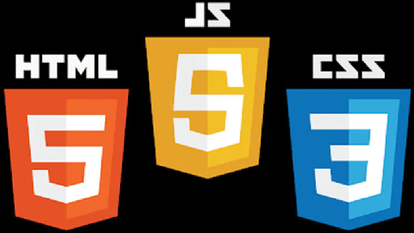
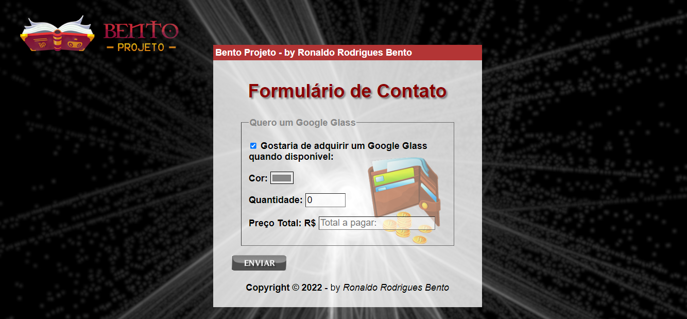
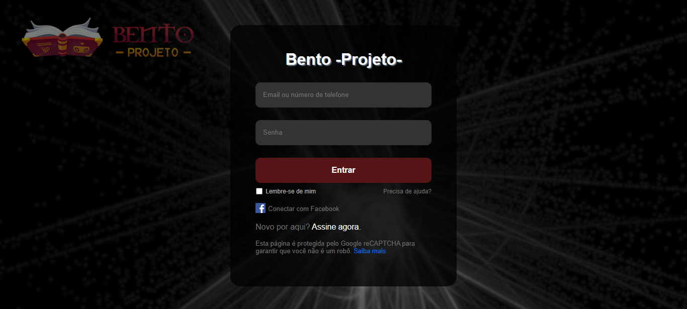

# HTML-CSS-JAVASCRIPT
 
 
  
 
 
<strong>Exercícios Básicos de HTML5-CSS3 e Java Script</strong>

 
 ## IMPORTANTE ##
 
   
  
 
Você tem todo o direito de usar esse material para seu próprio aprendizado. Espero que seja útil o conteúdo disponibilizado.
 
 
 <h2>:bookmark_tabs: Descrição</h2>
 
 
JavaScript é uma linguagem de programação de alto nível criada, a princípio, para ser executada em navegadores e manipular comportamentos de páginas web.
 Segundo a <em>Mozilla Foundation</em>, atual nome da antiga Netscape Communications Corporations, empresa responsável pela criação do JS, "JavaScript é uma linguagem de programação, leve, interpretada, orientada a objetos, baseada em protótipos e em first-class functions (funções de primeira classe), mais conhecida como a linguagem de script da Internet."

Com seus scripts é possível incluir, em uma página estática, elementos dinâmicos como mapas, formulários, operações numéricas, animações, infográficos interativos e muito mais.

 
  
 ## Exemplos de códigos:

   

  

  
 
## Lista de exercícios de HTML-CSS

 
O <strong>GitHub Pages</strong> é um serviço de hospedagem de site estático que usa arquivos HTML, CSS e JavaScript diretamente de um repositório no GitHub e, como opção, executa os arquivos por meio de um processo e publica um site.
 

<a href="https://ronaldobento.github.io/html-css/exercicios/ex01/index.html" target="_blank" rel="external" title="exercício 01"><strong>exercício 01</strong></a>

<a href="https://ronaldobento.github.io/html-css/exercicios/ex02/index.html" target="_blank" rel="external" title="exercício 02"><strong>exercício 02</strong></a>

<a href="https://ronaldobento.github.io/html-css/exercicios/ex03/index.html" target="_blank" rel="external" title="exercício 03"><strong>exercício 03</strong></a>

<a href="https://ronaldobento.github.io/html-css/exercicios/ex04/index.html" target="_blank" rel="external" title="exercício 04"><strong>exercício 04</strong></a>

<a href="https://ronaldobento.github.io/html-css/exercicios/ex05/index.html" target="_blank" rel="external" title="exercício 05"><strong>exercício 05</strong></a>

<a href="https://ronaldobento.github.io/html-css/exercicios/ex06/index.html" target="_blank" rel="external" title="exercício 06"><strong>exercício 06</strong></a>

<a href="https://ronaldobento.github.io/html-css/exercicios/ex07/index.html" target="_blank" rel="external" title="exercício 07"><strong>exercício 07</strong></a>

<a href="https://ronaldobento.github.io/html-css/exercicios/ex08/index.html" target="_blank" rel="external" title="exercício 08"><strong>exercício 08</strong></a>

<a href="https://ronaldobento.github.io/html-css/exercicios/ex09/index.html" target="_blank" rel="external" title="exercício 09"><strong>exercício 09</strong></a>

<a href="https://ronaldobento.github.io/html-css/exercicios/ex10/index.html" target="_blank" rel="external" title="exercício 10"><strong>exercício 10</strong></a>

<a href="https://ronaldobento.github.io/html-css/exercicios/ex11/index.html" target="_blank" rel="external" title="exercício 11"><strong>exercício 11</strong></a>

<a href="https://ronaldobento.github.io/html-css/exercicios/ex12/index.html" target="_blank" rel="external" title="exercício 12"><strong>exercício 12</strong></a>

<a href="https://ronaldobento.github.io/html-css/exercicios/ex13/index.html" target="_blank" rel="external" title="exercício 13"><strong>exercício 13</strong></a>

<a href="https://ronaldobento.github.io/html-css/exercicios/ex14/index.html" target="_blank" rel="external" title="exercício 14"><strong>exercício 14</strong></a>

